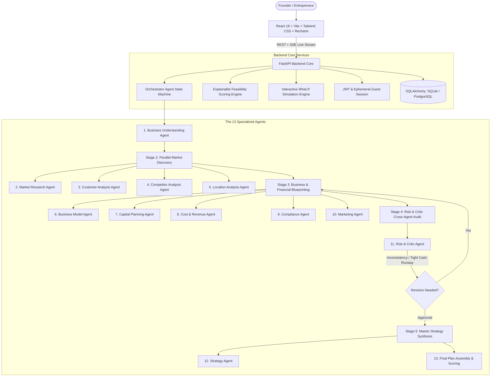

# NEXORA: Intelligent multiagent for business planning startup
### Tagline: *?From Capital to Business.?*

[](https://fastapi.tiangolo.com)
[](https://reactjs.org)
[](https://vitejs.dev)
[](https://python.org)
[](https://tailwindcss.com)
[](LICENSE)

---

## 1. Project Vision

**NEXORA** is a multi-agent AI business planning and validation platform designed for aspiring entrepreneurs, small-business founders, and students who have available capital and an industry sector in mind, but lack a practical, verified roadmap to execute.

NEXORA transforms:
$$\text{Available Capital} + \text{Chosen Sector} + \text{Location} + \text{Goals} + \text{Preferences}$$

into:
$$\text{Market Demand} + \text{Customer Personas} + \text{Moats} + \text{Business Model} + \text{Capital Allocation} + \text{Cost \& Revenue Projections} + \text{Compliance Checklist} + \text{Marketing Playbook} + \text{Risk Register} + \text{9-Phase Roadmap}$$

**NEXORA is NOT a generic chatbot.** It is a genuine **Multi-Agent Orchestrator** where 13 specialized agents perform domain-specific research, exchange structured findings, cross-audit financial and operational dependencies, and actively trigger **Critic Revision Loops** to rectify liquidity or assumption mismatches before finalizing an executive-grade business plan.

---

## 2. Multi-Agent Architecture



---

## 3. The 13 Specialized Agents

| # | Agent Name | Domain Role | Key Deliverables |
|---|---|---|---|
| **1** | **Business Understanding** | Profile Normalization | Cleans and normalizes capital, currency, location, risk posture, and timeframe constraints. |
| **2** | **Market Research** | Industry Economics | Computes TAM, SAM, SOM, 5-year CAGR, industry drivers, and macro headwinds. |
| **3** | **Customer Analysis** | Persona Profiling | Evaluates 3 distinct customer segments, Average Order Value (AOV), buying frequency, and pain points. |
| **4** | **Competitor Analysis** | Landscape & Moats | Analyzes direct chains and local unorganized players, identifying pricing power and differentiation moats. |
| **5** | **Location Analysis** | Geographic Fit | Evaluates top 3 micromarkets, commercial rent/sq.ft benchmarks, footfall, and delivery radius access. |
| **6** | **Business Model** | Revenue Architecture | Develops Lean Canvas, diversified revenue streams (dine-in, delivery, catering), and unit contribution margins. |
| **7** | **Capital Planning** | Allocation Strategist | Decomposes capital dynamically across 8 operational buckets. Adapts during Critic feedback loops. |
| **8** | **Cost & Revenue** | Financial Projections | Models setup Capex, monthly fixed burn, break-even unit volumes, and 3-year financial scenarios. |
| **9** | **Compliance** | Statutory Specialist | Assembles mandatory licenses (FSSAI, GSTIN, Trade License, Fire NOC) with advisory disclaimers. |
| **10** | **Marketing** | Go-To-Market Playbook | Creates 3-phase promotional campaign (Pre-launch, Launch week, 90-day scale) with CAC targets. |
| **11** | **Risk & Critic** | Chief Risk Officer | Cross-audits all outputs for budget deficits or tight runways; issues formal revision requests. |
| **12** | **Strategy** | Strategic Synthesis | Generates SWOT matrix, 4 strategic execution pillars, and a sequential 9-phase launch roadmap. |
| **13** | **Orchestrator** | State Machine Controller | Central DAG controller; manages step transitions, SSE event streaming, and DB persistence. |

---

## 4. The Critic Revision Loop in Action

When **NEXORA** executes a plan:
1. The **Capital Planning Agent** makes an initial allocation where physical Capex (setup + equipment) accounts for 43% of capital, leaving a 17% liquid safety buffer.
2. The **Cost & Revenue Agent** projects a monthly fixed burn of ?1.25L.
3. The **Risk & Critic Agent** computes that 17% buffer (?1.7L) provides only **1.4 months of operational runway**, which is dangerously tight for an early-stage venture ramping to break-even over 6-7 months.
4. The Critic triggers **`revision_needed = True`** with the challenge:
   > *"CRITIC ALERT: Dedicated working capital buffer covers only 1.4 months of burn. Downscale equipment/setup spend by 9% and reallocate directly into Working Capital Reserve."*
5. The **Capital Planning Agent** re-executes with updated parameters, trimming heavy Capex and fortifying the liquid buffer to **25% (?2.5L)**.
6. The Critic audits the revised envelope and issues **`verdict = "VALIDATION_APPROVED"`**.
7. The entire exchange is visually logged and presented in the **Agent Workspace**.

---

## 5. Transparent Feasibility Scoring (8 Pillars)

Every generated business plan receives an explainable composite feasibility score (0?100) calculated across 8 distinct dimensions:

1. **Capital Adequacy (20%)**: Runway coverage and capex absorption.
2. **Market Attractiveness (15%)**: Industry TAM and CAGR momentum.
3. **Customer Demand Clarity (12%)**: Segment identification and willingness-to-pay.
4. **Competitive Moat (12%)**: Protection against incumbent price wars.
5. **Location Fit (12%)**: Catchment footfall and rent/sq.ft viability.
6. **Financial Viability (15%)**: Break-even speed and unit contribution margin.
7. **Risk Resilience (8%)**: Liquidity buffers against cash-flow volatility.
8. **Business Model Strength (6%)**: Revenue diversification.

All recommendations include full explainability cards:
- *Why this recommendation?*
- *Key assumptions*
- *Main risks*
- *Confidence level*
- *Data sources & industry benchmarks*

---

## 6. Interactive "What If?" Simulator

Users can dynamically test sensitivities on any generated plan:
- Tweak **Available Capital** (slider from ?3L to ?35L).
- Adjust **Operational Scale** (0.5x micro pod to 2.0x expanded flagship).
- Shift **Risk Postures** (Conservative, Moderate, Aggressive).
- Relocate to different metropolitan clusters.

NEXORA recalculates the business model and displays a side-by-side **Diff View**:
- Feasibility score variance ($+/-$ points)
- Capital reallocation comparison
- Cash runway variance ($+/-$ months)
- Shift in break-even milestone
- Adjusted risk warnings and calibrated roadmap milestones

---

## 7. The Hyderabad Food & Beverage ?10 Lakh Demo

To immediately test the platform:
1. Open the web application and click **"Launch Hyderabad F&B Demo (?10L)"** on the landing page.
2. Observe the **Live Agent Workspace**:
   - Stage 1: Business Profile Normalization
   - Stage 2: Parallel Market, Customer, Competitor, and Location analysis
   - Stage 3: Business Model, Capital, Cost & Revenue, Compliance, and Marketing
   - Stage 4: **Risk & Critic Agent challenges tight initial working capital runway** $\rightarrow$ triggers live revision $\rightarrow$ fortifies liquid reserve to 25% $\rightarrow$ validates approval
   - Stage 5: Strategy Agent Master Synthesis
3. Review the **Executive Business Dashboard**:
   - Feasibility Score Gauge (e.g. 78/100)
   - Interactive Capital Donut Chart
   - 12-Month Financial Projections Area Chart
4. Navigate to **Full Strategy**: Review the 9-Phase Launch Roadmap and Compliance Checklist.
5. Open **What-If Simulator**: Increase capital to ?18 Lakh and watch the feasibility score and runway expand in real time.

---

## 8. Quickstart Guide

### Prerequisites
- Python 3.11+
- Node.js 18+ and npm

### Local Run (Zero Configuration Mode)

**1. Backend Server**:
```bash
cd backend
python -m pip install -r requirements.txt
python -m uvicorn app.main:app --host 0.0.0.0 --port 8000 --reload
```
API Documentation available at: `http://localhost:8000/docs`

**2. Frontend Server**:
```bash
cd frontend
npm install
npm run dev
```
Open your browser at: `http://localhost:3000`

---

## 9. Automated Test Suite

Run the comprehensive pytest suite covering all 13 agents, the Critic feedback loop, the scoring engine, and the end-to-end plan lifecycle:
```bash
cd backend
pytest tests -v
```
Output:
```text
backend/tests/test_backend.py::test_health_check PASSED                  [ 14%]
backend/tests/test_backend.py::test_get_sectors PASSED                   [ 28%]
backend/tests/test_backend.py::test_guest_auth PASSED                    [ 42%]
backend/tests/test_backend.py::test_all_12_agents_execution PASSED       [ 57%]
backend/tests/test_backend.py::test_critic_feedback_and_revision_loop PASSED [ 71%]
backend/tests/test_backend.py::test_scoring_and_what_if PASSED           [ 85%]
backend/tests/test_backend.py::test_end_to_end_plan_flow PASSED          [100%]
======================== 7 passed in 1.61s ========================
```

---

## 10. Docker Compose Deployment

To run in a containerized production environment with PostgreSQL:
```bash
docker-compose up --build
```
Services deployed:
- `nexora_frontend`: React application served via Nginx on port `3000`
- `nexora_backend`: FastAPI server on port `8000`
- `nexora_postgres`: PostgreSQL 16 on port `5432`

---

## 11. Project Monorepo Structure

```text
nexora/
??? backend/
?   ??? app/
?   ?   ??? api/v1/endpoints/  # Auth, Plans, Sectors, Simulation, Health
?   ?   ??? core/              # Config, Security, JWT
?   ?   ??? db/                # Base, Session, Init DB
?   ?   ??? models/            # SQLAlchemy Models (User, Plan, AgentRun, Scenario)
?   ?   ??? schemas/           # Pydantic v2 Schemas
?   ?   ??? services/          # LLM Adapter, Scoring Engine, What-If Engine
?   ?   ??? agents/            # The 13 Specialized Agents & Orchestrator
?   ?   ??? main.py            # FastAPI Application Entrypoint
?   ??? requirements.txt
?   ??? tests/                 # Pytest Automated Test Suite
??? frontend/
?   ??? src/
?   ?   ??? api/               # REST Client & SSE Stream Parser
?   ?   ??? components/        # Gauge, CapitalChart, RevenueChart, Roadmap, Cards
?   ?   ??? pages/             # Landing, Onboarding, Workspace, Dashboard, Plan, WhatIf, Saved, Settings
?   ?   ??? utils/             # Pre-configured Industry Presets
?   ??? package.json
?   ??? vite.config.js
?   ??? tailwind.config.js
??? data/
?   ??? seed_data.json         # Benchmarks across 8 sectors
??? docs/                      # PRD, Architecture, Agent Design, API Spec, DB Schema
??? docker/                    # Dockerfiles for Backend and Frontend
??? docker-compose.yml
??? .env.example
??? README.md
```

---

## 12. Responsible AI Notice

NEXORA is a **business decision-support system**, not an investment guarantee. All market sizing estimates, financial break-even projections, and cost estimates are modeled assumptions derived from industry averages. Users should verify statutory regulations with certified local counsel and conduct on-ground due diligence before making capital commitments.
