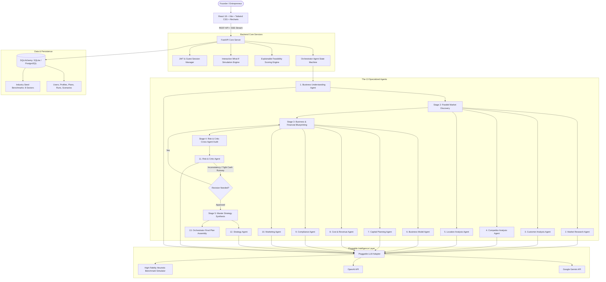

# NEXORA: Intelligent multiagent for business planning startup

**Project Title**: **NEXORA: Intelligent multiagent for business planning startup**  
**Tagline**: **?From Capital to Business.?**

---

## 1. High-Level Architectural Blueprint

NEXORA is built on an enterprise-grade, asynchronous, multi-agent orchestration pattern. It avoids shallow single-prompt chat interactions by decomposing business planning into specialized autonomous agents that execute sequentially and in parallel, cross-validate each other's outputs, and actively demand revisions when financial, operational, or regulatory inconsistencies are detected.

---

## 2. Multi-Agent Collaboration & The Critic Loop

Unlike systems that merge independent prompts, NEXORA agents exchange structured JSON payloads and cross-audit dependencies:

1. **Capital vs. Burn Cross-Audit**: The **Risk & Critic Agent** audits the ratio of `Working Capital Reserve + Contingency` produced by the **Capital Planning Agent** against the `Monthly Operating Burn` modeled by the **Cost & Revenue Agent**.
2. **Dynamic Revision Demand**: If the liquid safety buffer covers less than 2.0 months of operating burn, the Critic flags `verdict = "REVISION_REQUIRED"` and issues concrete rebalancing instructions.
3. **Agent Rebalancing**: The **Capital Planning Agent** re-runs with `is_revision = True`, trimming physical machinery and setup Capex by 8-9% and channeling capital into liquid working capital reserves.
4. **Second-Pass Validation**: The Critic re-evaluates the revised financial envelope and marks `verdict = "VALIDATION_APPROVED"`.
5. **Master Strategy Synthesis**: The **Strategy Agent** integrates all validated findings into an 11-week, 9-phase launch roadmap with SWOT analysis and execution pillars.

---

## 3. Technology Stack

- **Frontend**: React 18, Vite 5, Tailwind CSS 3.4, Recharts 2.12, Lucide Icons
- **Backend**: Python 3.11, FastAPI 0.110, Pydantic v2, SQLAlchemy 2.0, Uvicorn
- **Database**: SQLite (default zero-friction local mode) / PostgreSQL (production docker mode)
- **Agent Framework**: Custom Directed Acyclic Graph (DAG) state machine with Server-Sent Events (SSE) streaming
- **Authentication**: JWT Bearer Tokens + Instant 1-Click Guest Founder session
- **Testing**: Pytest test suite covering all 13 agents, critic loop, and endpoints
